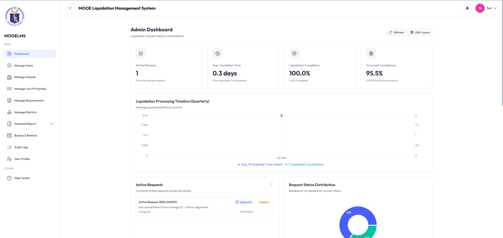
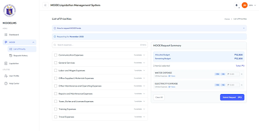
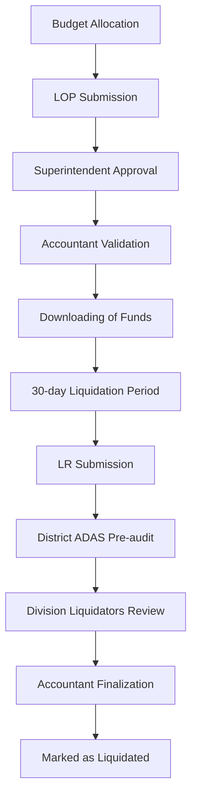
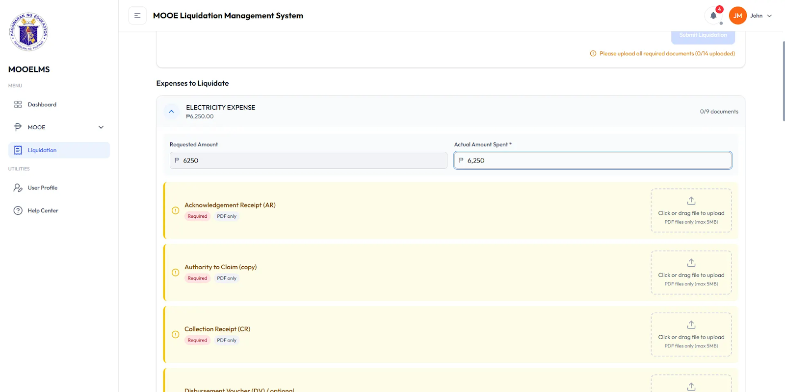
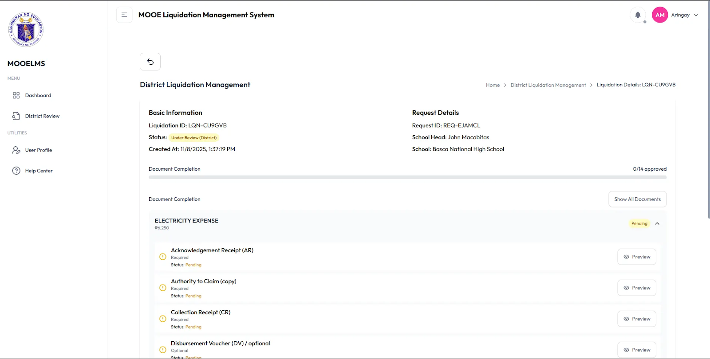
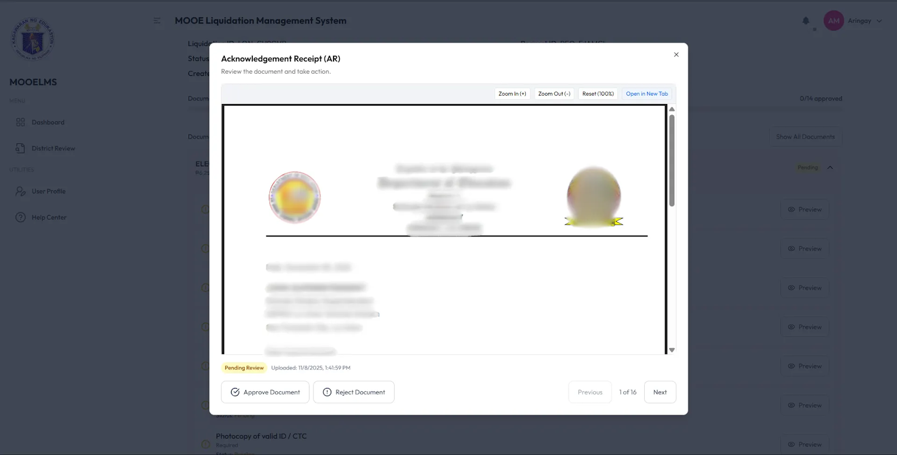
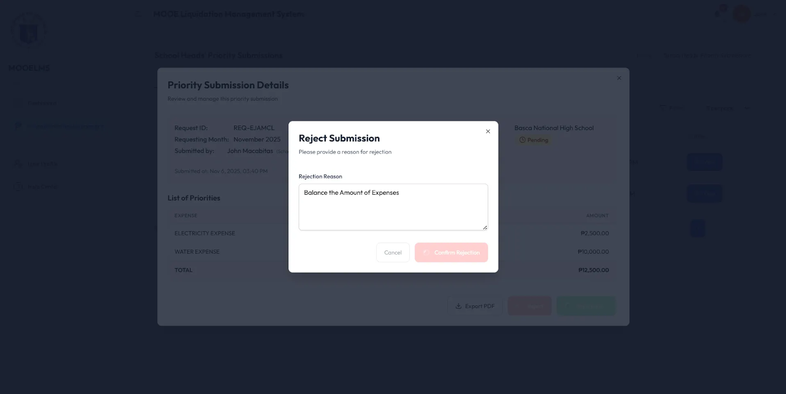
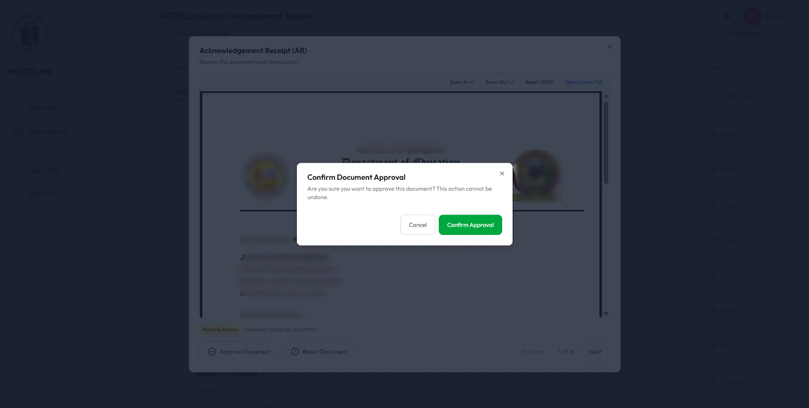

Perfect! Let me integrate this crucial information to create a more comprehensive and accurate README that properly showcases the problem-solution approach.

# MOOE Liquidation Management System

A comprehensive web-based platform designed to streamline and automate the Maintenance and Other Operating Expenses (MOOE) liquidation process for the Department of Education - La Union Schools Division.

*System Overview Admin Dashboard*

## 📋 Table of Contents
- [Overview](#overview)
- [Problem Definition](#problem-definition)
- [System Objectives](#system-objectives)
- [Key Features](#key-features)
- [User Roles](#user-roles)
- [Workflow Process](#workflow-process)
- [Screenshots](#screenshots)
- [Technical Details](#technical-details)

## 🎯 Overview

The MOOE Liquidation Management System addresses critical inefficiencies in financial management processes by replacing manual, paper-based systems with a digital workflow. The platform was designed to ensure compliance with COA Circular No. 2012-001 and solve documented operational challenges in the DepEd La Union Schools Division.

## ⚠️ Problem Definition

The system was developed to address three major challenges observed in the MOOE fund request and liquidation process:

### 1. Excessive Use of Paper-based Forms

- **Heavy reliance** on physical forms for LOP submissions and financial requests
- **Prone to physical loss** and data entry errors
- **Difficulty monitoring** submission status and maintaining historical records
- **Inefficient financial planning** due to manual processes

### 2. Delays and Non-Compliance in MOOE Liquidation

- **Significant number of schools** fail to complete liquidation within mandated 30-day period
- **Backlogs accumulate** over time, involving hundreds of unliquidated reports
- **Inadequate documentation** of fund utilization compromising accountability
- **Compromised audit readiness** due to delayed submissions

### 3. Inconsistencies in Documentation and Reporting

- **No standardized digital system** for LOPs and liquidation reports
- **Inconsistent report formats** and incomplete supporting documents
- **Varying interpretations** of requirements across different schools
- **Difficulty identifying discrepancies** and tracking reporting progress

## 🎯 System Objectives

### Primary Objective
Develop a comprehensive MOOE Liquidation Report System that addresses the documented challenges faced by DepEd La Union Schools Division.

### Specific Objectives

#### 1. Centralized Digital Repository

- **Eliminate paper-based forms** through digital submission
- **Secure centralized repository** for all MOOE-related documents
- **Prevent data loss** and reduce redundancy
- **Streamline LOP request** and liquidation submission process

#### 2. Enhanced Compliance & Accountability

- **Automated reminders** for outstanding liquidation tasks
- **Structured pre-audit workflows** for quality control
- **Flag backlogs** for overdue reports
- **Full traceability** of public fund utilization
- **Email notifications** and system alerts

#### 3. Standardized Documentation & Monitoring

- **Guided digital forms** with built-in validation
- **Integrated checklists** for allowable expenses
- **Uniform submissions** across all schools
- **Detailed status tracking** of MOOE requests and liquidations
- **Comprehensive action records** and approval trails

## ✨ Key Features

### 🔄 Automated Workflow Management

- **End-to-end digital workflow** from budget request to final liquidation
- **Role-specific dashboards** and task management
- **Automated routing** between different user roles
- **Progress tracking** with visual indicators

### ⏰ Smart Notifications & Alerts

*Automated reminder system*

- **Configurable deadline alerts** (15-day, 5-day, and overdue notifications)
- **System notifications** and email reminders
- **Automatic demand letters** for non-compliance
- **Real-time status updates**

### 📊 Real-time Monitoring & Reporting

*Comprehensive monitoring dashboard*

- **Division-wide submission tracking**
- **Liquidation status monitoring** across all schools
- **Automated validation** against allowable expense categories
- **Audit trail** and compliance reporting

### 📋 List of Priorities (LOP) Management

*List of Priorities submission interface*

- **Pre-defined allowable expense categories**
- **Budget validation** against monthly allocations
- **One active request limitation** per school
- **Historical request referencing** and reuse capability

## 👥 User Roles

| Role | Responsibilities | Key Features |
|------|-----------------|--------------|
| **School Head** | Submit LOP and Liquidation Reports | LOP creation, LR submission, request history |
| **Division Superintendent** | Approve/Reject LOP submissions | LOP review, feedback system, approval workflow |
| **Division Accountant** | Budget allocation and final approval | Fund validation, liquidation finalization |
| **District ADAS** | Pre-audit liquidation reports | Document validation, feedback provision |
| **Division Liquidators** | Secondary review of LRs | Quality control, discrepancy identification |
| **School ADAS** | Document preparation support | Document upload, preparation assistance |
| **Administrator** | System management | User management, system configuration |

## 🔄 Workflow Process

### Detailed Process Flow

1. **Budget Allocation** - Division Accountant allocates funds
2. **LOP Submission** - School Head submits List of Priorities for MOOE utilization
3. **Approval Workflow** - Multi-level approval process with feedback mechanisms
4. **Fund Transfer** - External (excluded in the system)
5. **Liquidation Period** - 30-day window with automated reminders
6. **Pre-audit & Review** - Two-tier validation process by District ADAS and Division Liquidators
7. **Finalization** - Division Accountant marks reports as liquidated

## 📸 Screenshots

### User Dashboard

*School-Head Dashboard*

### LOP Submission Interface

*Intuitive form for List of Priorities submission with budget validation*

### Liquidation Report Module

*Comprehensive liquidation report preparation with document upload*

*Success Message*

### Approval Workflow

*Approval interface in District ADAS view with feedback and validation tools*

## 🏗 System Architecture

### Technology Stack
- **Frontend**: React.js with TypeScript and Tailwind CSS
- **Backend**: Django REST Framework (Python)
- **Database**: MySQL
- **Authentication**: JWT with role-based access

## 🔮 Future Enhancements

- Mobile application for on-the-go access
- Advanced analytics and reporting features
- Integration with other DepEd systems
- AI-powered document validation

## 📄 License

This project is developed for the Department of Education - La Union Schools Division.

## 👨‍💻 Developer

This system was developed as a comprehensive solution addressing real-world challenges in government financial management, demonstrating expertise in:

- **Problem Analysis & Solution Design**
- **Government Financial Systems**
- **Workflow Automation & Digital Transformation**
- **Compliance-driven Development**
- **User-Centric System Design**

---

*For more information about implementation or customization, please contact the development team.*

